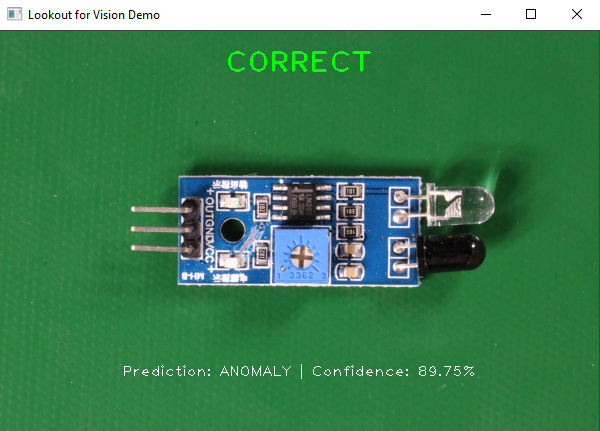

## Lookout for Vision Demo

### Overview

A simple demo application that uses [Amazon Lookout for Vision](https://aws.amazon.com/lookout-for-vision/) to detect anomalies and spot defects.

### Demo

> **Note:** *these instructions assume that a Lookout for Vision model is up and running.*

0. Install dependencies

    `pip install -r requirements.txt`

1. Setup AWS credentials

2. Download extra images

    `aws s3 cp s3://circuitboarddataset/circuit_board/extra_images/ extra_images/ --recursive`

3. Run application

### What is Amazon Lookout for Vision?

> Amazon Lookout for Vision is a machine learning (ML) service that spots defects and anomalies in visual representations using computer vision (CV). With Amazon Lookout for Vision, manufacturing companies can increase quality and reduce operational costs by quickly identifying differences in images of objects at scale. For example, Amazon Lookout for Vision can be used to identify missing components in products, damage to vehicles or structures, irregularities in production lines, miniscule defects in silicon wafers, and other similar problems. Amazon Lookout for Vision uses ML to see and understand images from any camera as a person would, but with an even higher degree of accuracy and at a much larger scale. Amazon Lookout for Vision allows customers to eliminate the need for costly and inconsistent manual inspection, while improving quality control, defect and damage assessment, and compliance. In minutes, you can begin using Amazon Lookout for Vision to automate inspection of images and objects–with no machine learning expertise required.

For more information, please visit [Amazon Lookout for Vision](https://aws.amazon.com/lookout-for-vision/)

### References

* (AWS) [AWS for Industrial](https://aws.amazon.com/industrial/)
* (AWS) [Amazon Lookout for Vision – General Information](https://aws.amazon.com/lookout-for-vision/)
* (AWS) [Amazon Lookout for Vision – Developer Guide](https://docs.aws.amazon.com/lookout-for-vision/latest/developer-guide/what-is.html)
* (AWS) [Amazon Lookout for Vision – API Reference](https://docs.aws.amazon.com/lookout-for-vision/latest/APIReference/Welcome.html)
* (AWS) [AWS CLI - `lookoutvision`](https://docs.aws.amazon.com/cli/latest/reference/lookoutvision/index.html)
* (AWS) [Boto3 – `LookoutForVision`](https://boto3.amazonaws.com/v1/documentation/api/latest/reference/services/lookoutvision.html)
* (AWS) [AWS SDK for Go - `lookoutforvision`](https://docs.aws.amazon.com/sdk-for-go/api/service/lookoutforvision/)
* (AWS) [AWS Announces Five Industrial Machine Learning Services](https://press.aboutamazon.com/news-releases/news-release-details/aws-announces-five-industrial-machine-learning-services)
* (AWS) [New ML Service Simplifies Defect Detection for Manufacturing](https://aws.amazon.com/blogs/aws/amazon-lookout-for-vision-new-machine-learning-service-that-simplifies-defect-detection-for-manufacturing/)
* (AWS) [How a ‘Think Big’ idea helped bring Lookout for Vision to Life](https://www.amazon.science/latest-news/how-a-think-big-idea-helped-bring-lookout-for-vision-to-life)
* (AWS) [Amazon Lookout for Vision – Pricing](https://aws.amazon.com/lookout-for-vision/pricing/)
* (GitHub) [Amazon Lookout for Vision Demo](https://github.com/aws-samples/amazon-lookout-for-vision-demo)
* (1Strategy) [Quick Take: Amazon Lookout for Vision](https://www.1strategy.com/blog/2020/12/07/quick-take-amazon-lookout-for-vision/)
* (YouTube) [AWS on Air 2020: What’s Next ft. Amazon Lookout for Vision](https://www.youtube.com/watch?v=fOh-p9P8TFo)
* (Provectus) [Defect Detection with Amazon Lookout for Vision](https://provectus.com/defect-detection-amazon-lookout-for-vision/)

